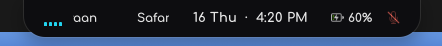
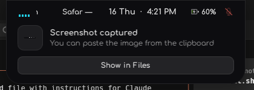
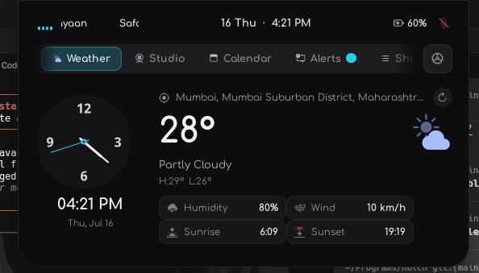
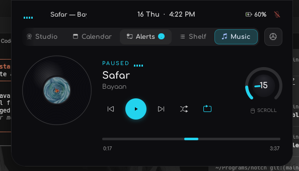

<div align="center">

# NotchNux

### A dynamic, macOS-style **Notch** and dashboard for GNOME Shell

A pill that lives at the top of your screen, morphs to show what you're doing, and expands into a full glassy dashboard for music, weather, your webcam, calendar, notifications and a file shelf.


[](LICENSE)


</div>

---

## ✨ What is it?

NotchNux replaces the default GNOME top-bar clock with a **living pill**. At a glance it shows the date, time, battery and privacy (mic/camera) indicators. While music plays, the track title scrolls across it. When a notification arrives, the pill **morphs into a banner** with action buttons. Click it and it opens into a **tabbed dashboard** — a little control center that follows your accent color.

<div align="center">



</div>

## 🧩 Features

| | Feature | What it does |
|---|---|---|
| 🎵 | **Music / MPRIS** | Full player with album art, a spinning vinyl, scrubber, shuffle/repeat, and a volume dial — works with any MPRIS player (Spotify, browsers, etc.). |
| 🌤️ | **Weather** | Current conditions, an analog clock, humidity, wind, sunrise/sunset and hourly forecast. Auto-locates or set a manual location. |
| 📷 | **Studio** | Live webcam preview (GStreamer) plus video and audio-only recording, with camera/mic device selection. |
| 📅 | **Calendar** | Month view with your events pulled from GNOME Online Accounts. |
| 🔔 | **Alerts** | Notification history, and a **peek** mode where the pill expands into a banner with action buttons the moment a notification arrives. |
| 🗂️ | **Shelf** | A drag-and-drop scratch space for files plus a quick notes pad, stored under `~/.local/share/notchnux`. |
| 🖥️ | **Tray / System** | Live CPU, memory, network throughput, battery and a brightness slider. |
| 🎨 | **Theming** | Pick any accent color — the whole UI, dials and highlights recolor live. Reorder or hide dashboard tabs. Toggle individual features on/off. |

### Collapsed pill indicators
- 📆 Date & time (pill sizes to its content so the clock never truncates)
- 🔋 Battery percentage & charging state
- 🎤/📷 Privacy dots when the mic or camera is in use
- 🎶 Scrolling now-playing title while media is active

## 🖼️ Screenshots

<div align="center">

**Notification peek** — the pill smoothly expands into a banner with actions


**Dashboard · Weather tab** — analog clock, conditions and forecast


**Dashboard · Music tab** — vinyl art, scrubber and a volume dial


</div>

## 📦 Installation

### Requirements
- **GNOME Shell 45 – 51** (Wayland or X11)
- `gnome-shell-extensions` (for the `gnome-extensions` CLI)
- **Optional:** GStreamer 1.0 (`gstreamer1-plugins-*` / `gstreamer1.0-plugins-*`) for the Studio webcam & recording tab

On **Fedora**:
```bash
sudo dnf install gnome-shell-extensions gstreamer1-plugins-good gstreamer1-plugins-bad-free
```

On **Ubuntu / Debian**:
```bash
sudo apt install gnome-shell-extensions gstreamer1.0-plugins-good gstreamer1.0-plugins-bad
```

### Install from source
```bash
git clone https://github.com/Adityasah2004/NotchNux.git
cd NotchNux
./install.sh
```

Then **reload GNOME Shell** so it loads the extension:
- **Wayland:** log out and log back in
- **X11:** press `Alt`+`F2`, type `r`, press `Enter`

The installer auto-enables the extension. If it couldn't, enable it manually:
```bash
gnome-extensions enable notchnux@adityasah.programs
```

### Try it without reloading your session
Run it in a nested GNOME session so nothing touches your real desktop:
```bash
dbus-run-session -- gnome-shell --nested --wayland
```

## 🕹️ Usage

- **Click the pill** to open the dashboard; click outside (or the pill) to collapse it.
- **Switch tabs** with the carousel at the top of the dashboard.
- **Open settings** (⚙️ in the dashboard) to change the accent color, reorder or hide tabs, and toggle features.

Configuration is stored as plain JSON under `~/.config/notchnux/config.json` — no GSettings schema required.

## ⚙️ Configuration & data locations

| Path | Contents |
|---|---|
| `~/.config/notchnux/config.json` | Accent color, tab order & visibility, feature toggles |
| `~/.config/notchnux/settings.json` | Manual weather location |
| `~/.local/share/notchnux/shelf/` | Files dropped into the Shelf |
| `~/.local/share/notchnux/notes.txt` | Notes pad content |

## 🐛 Troubleshooting

- **Nothing appears after install** → you must reload the shell (log out/in on Wayland). Confirm it's enabled: `gnome-extensions info notchnux@adityasah.programs`.
- **Studio tab is empty / no webcam** → install the GStreamer plugins listed above.
- **Check logs** while it runs:
  ```bash
  journalctl -f -o cat /usr/bin/gnome-shell
  ```

## 🤝 Contributing

This is a young project and **help is very welcome** — bug reports, feature ideas, theming tweaks, and PRs all make it better. If you're on Fedora (or any GNOME distro) and try it out, please open an issue with what worked and what didn't. 🙏

1. Fork the repo and create a branch.
2. Make your change and test it in a nested session.
3. Open a pull request describing what you changed and why.

## 📄 License

Released under the [MIT License](LICENSE). © 2026 Aditya Sah.
